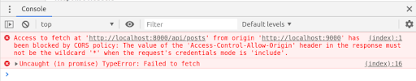

Cuando desarrollamos una API y queremos que todos sus recursos estén disponibles para cualquier cliente HTTP, una de las cosas que nos viene a la mente es CORS (Cross-Origin Resource Sharing), en Español, “Intercambio de recursos con diferentes orígenes” Si aún no te ha pasado, no te preocupes, es normal tener errores de CORS al consumir y poner a disposición las APIs.

Same-origin policy
Por defecto, una aplicación Front-end, escrita en JavaScript, solo puede acceder a los recursos ubicados en el mismo origen de la solicitud. Esto sucede debido a la política del mismo origen (same-origin policy), que es un mecanismo de seguridad de los navegadores que restringe la forma en que un documento o script de un origen interactúa con los recursos de otro. Esta política tiene como objetivo detener los ataques maliciosos.

Dos URL comparten el mismo origen si el protocolo, el puerto (si se especifica) y el host son los mismos. Comparemos posibles variaciones considerando la URL https://cursos.alura.com.br/category/programacao:

URL	Resultado	Motivo
https://cursos.alura.com.br/category/front-end	Mismo origen	Solo camino diferente
http://cursos.alura.com.br/category/programacao	Error de CORS	Protocolo diferente (http)
https://faculdade.alura.com.br:80/category/programacao	Error de CORS	Host diferente
Ahora, la pregunta sigue siendo: ¿qué hacer cuando necesitamos consumir una API con una URL diferente sin tener problemas con CORS? Como, por ejemplo, cuando queremos consumir una API que se ejecuta en el puerto 8000 desde una aplicación React que se ejecuta en el puerto 3000. ¡Compruébalo!

Al enviar una solicitud a una API de origen diferente, la API debe devolver un header llamado Access-Control-Allow-Origin. Dentro de ella es necesario informar los diferentes orígenes que serán permitidas de consumir la API, en nuestro caso: Access-Control-Allow-Origin: http://localhost:3000.

Puede permitir el acceso desde cualquier origen utilizando el símbolo * (asterisco): Access-Control-Allow-Origin: *. Pero esta no es una medida recomendada, ya que permite que fuentes desconocidas accedan al servidor, a menos que sea intencional, como en el caso de una API pública. Ahora veamos cómo hacer esto en Spring Boot correctamente.

Habilitación de diferentes orígenes en Spring Boot
Para configurar el CORS y permitir que un origen específico consuma la API, simplemente cree una clase de configuración como la siguiente:

@Configuration
public class CorsConfiguration implements WebMvcConfigurer {

    @Override
    public void addCorsMappings(CorsRegistry registry) {
        registry.addMapping("/**")
            .allowedOrigins("http://localhost:3000")
            .allowedMethods("GET", "POST", "PUT", "DELETE", "OPTIONS", "HEAD", "TRACE", "CONNECT");
    }
}
COPIA EL CÓDIGO
http://localhost:3000 sería la dirección de la aplicación Front-end y .allowedMethods los métodos que se permitirán ejecutar. Con esto, podrás consumir tu API sin problemas desde una aplicación front-end.