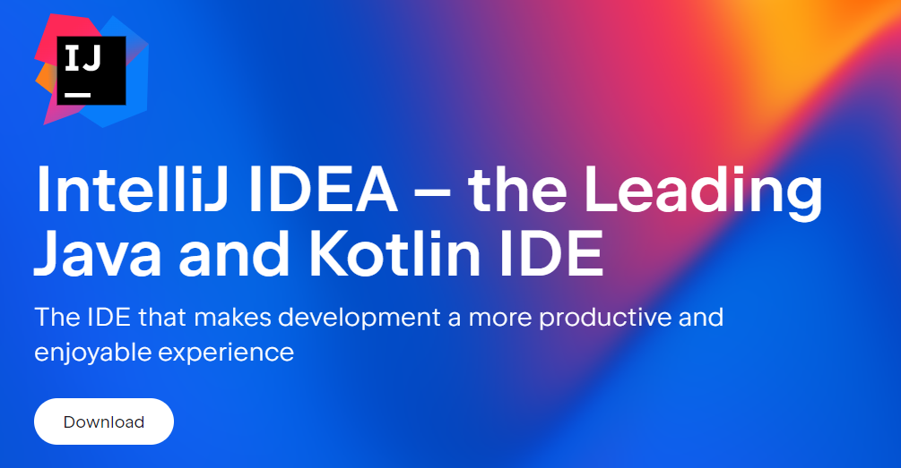
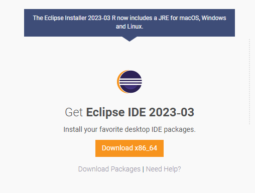
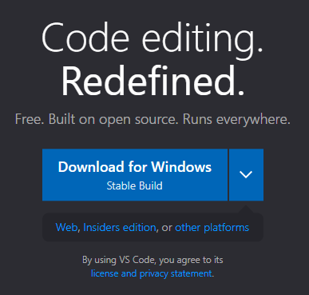
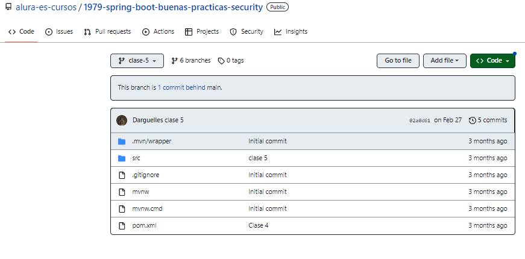
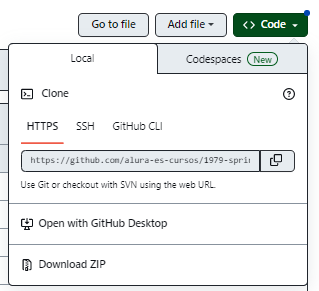
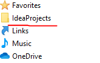
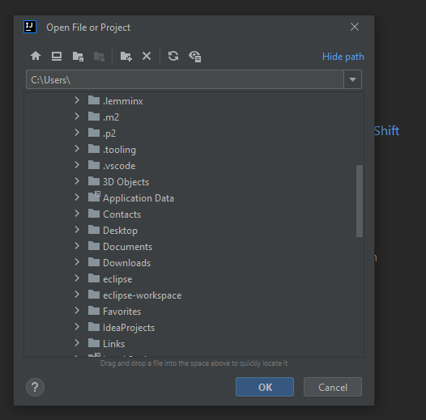
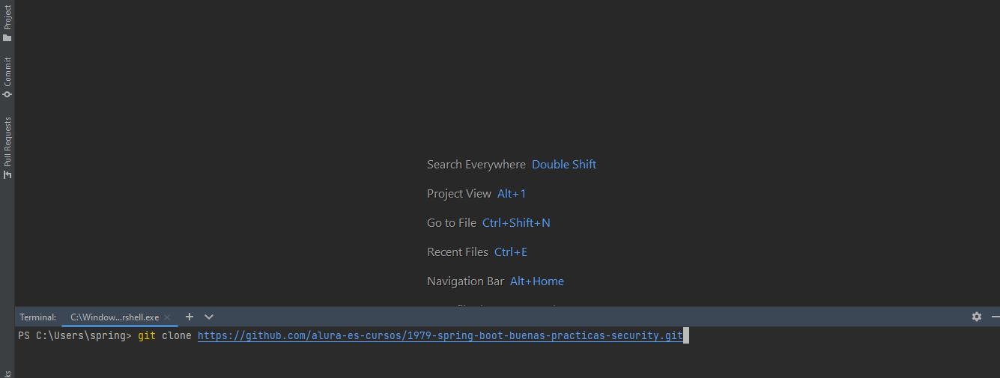
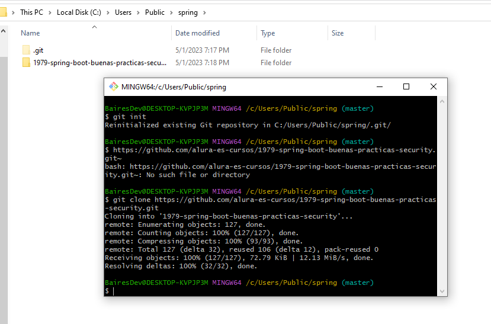

Para preparar el ambiente, necesitamos tener algunas cosas instaladas en la computadora, como:

IntelliJ
Para instalar IntelliJ, clique en el link y descargue la versión actual.

IntelliJ IDEA

Alternativamente:

1) Podemos trabajar con editores de código como Eclipse, visual studio code, pero estos tienen configuraciones diferentes a las que serán utilizadas en el video, sin embargo, es posible trabajar con ellos dejando como desafío usar otro editor de código.

The Eclipse Foundation

Visual Studio Code

Para comenzar esta tercera parte del curso necesitamos descargar la versión del curso anterior que podemos encontrar en el siguiente link click aqui.

En la imagen superior podemos ver como se encuentra el repositorio vamos a descargar el archivo .zip

Luego vamos a extraer este archivo en la carpeta donde se encuentra el resto de las informaciones de spring para este curso.

Luego de haber descargado la información del curso anterior vamos a abrir la IDE de eclipse, seleccionar en la pestaña de nuevo abrir un proyecto existente, seleccionamos el archivo del directorio y finalizar.

Alternativamente podemos clonar el repositorio desde la consola de IntelliJ

O utilizando git bash console.

En estos links podemos encontrar el soporte visual de la aplicación mobile front end y las diferentes actividades que fueron realizada

Aplicación mobile Front End

Solicitud del cliente para la API