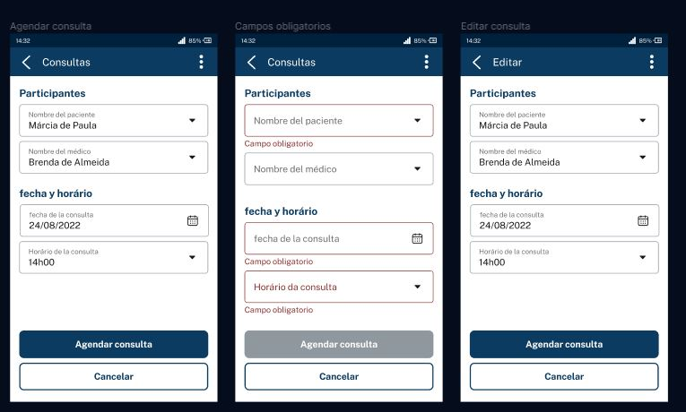

Ha llegado el momento de que sigas todos los pasos que he dado durante esta lección. En caso de que ya lo hayas hecho, excelente. Si aún no lo ha hecho, es importante que realice lo que se vio en los videos para que pueda continuar con la siguiente lección.

¡Vamos a empezar el proyecto! En la columna "DONE" en Trello, podemos ver que ya hemos implementado las funcionalidades de CRUD para médicos y pacientes. En la columna "TO DO" a la izquierda, faltan las funcionalidades de programación y cancelación de citas.

Comenzaremos implementando la programación. Por lo tanto, moveremos la tarjeta "Agendamiento de consultas" a la columna "DOING". Con un clic en la tarjeta, abriremos su información y, como de costumbre, leeremos la descripción de la funcionalidad para entender lo que necesitamos hacer.

La descripción dice lo siguiente:

"El sistema debe tener una funcionalidad que permita la programación de citas, en la que se deben completar la siguiente información: Paciente, Médico, Fecha/Hora de la consulta".

"Se deben validar las siguientes reglas de negocio por parte del sistema: (sigue una lista con reglas de negocio)".

Esta es una funcionalidad similar a las que ya hemos implementado. Nuestra API recibirá una solicitud con el ID del paciente o del médico y la fecha en que se realizará la consulta.

Con esta información, realizaremos las validaciones y las guardaremos en la base de datos. La diferencia es que ahora tenemos reglas de negocio más complejas que las que hemos visto anteriormente para médicos y pacientes.

Abrimos nuestro diseño de Figma con un modelo de aplicación móvil para nuestro proyecto.

 

En la aplicacion móvil, la persona tendrá una pantalla para agendar una nueva consulta, que contiene el nombre del paciente y del médico o médica. Estas informaciones serán extraídas de nuestra base de datos. Además, habrá dos campos para la elección del día y de la hora de la consulta, así como un botón para confirmar la programación.

Por lo tanto, la aplicación móvil necesita hacer validaciones de los campos obligatorios, siendo opcional solamente el campo "Nombre del médico". Cuando la persona complete todos los campos obligatorios y haga clic en "Agendar consulta", se disparará una solicitud a nuestra API. Necesitaremos recibir estos datos y tratarlos como ya hemos hecho en las otras funcionalidades.

Volviendo a la tarjeta en Trello, la única diferencia son algunas de las validaciones, que requerirán la escritura de un algoritmo, consulta en la base de datos, etc.

Así, estas no son sólo validaciones de formulario como aquellas con las que trabajamos anteriormente con BEAN validation (campo obligatorio, campo número o texto, tamaño mínimo y máximo, etc.). Ahora, tendremos que aprender a trabajar con validaciones un poco más complejas.

Códigos para nuevas funcionalidades

Para implementar esta o cualesquiera otras funcionalidades, seguimos una especie de paso a paso. Necesitamos crear siempre los siguientes tipos de códigos:

Controller, para mapear la solicitud de la nueva funcionalidad;
DTOs, que representan los datos que llegan y salen de la API;
Entidad JPA;
Repository, para aislar el acceso a la base de datos;
Migration, para hacer las alteraciones en la base de datos.
Estos son los cinco tipos de código que siempre desarrollaremos para una nueva funcionalidad. Esto también se aplica al agendamiento de las consultas, incluyendo un sexto elemento a la lista, las reglas de negocio. En esta clase, entenderemos cómo implementar las reglas de negocio con algoritmos más complejos.

Implementando la funcionalidad

Ahora que ya entendemos lo que necesita ser hecho, desarrollaremos la funcionalidad por partes. Empezaremos por los primeros cinco elementos de la lista, que son más básicos. Luego, abordaremos la parte de reglas de negocio.

Abriré el IntelliJ con el proyecto importado en la IDE. Es el mismo proyecto del curso anterior, que finalizamos con la parte de seguridad y tratamiento de errores.

Como la primera parte seguirá un mismo patrón, dejé esas clases listas en el código. Creé un nuevo ConsultaController en el paquete "src > main > java > med.voll.api > controller".

Ya que no estaremos más registrando pacientes, sino consultas, la idea es tener un Controller para recibir esas solicitudes relacionadas con la programación de consultas.

Es una clase Controller, con las anotaciones del Spring: @Controller,@ResponseBody, @RequestMapping("consultas") o @RestController. Mapea las solicitudes que llegan con la URI "/consultas", sabiendo que debe llamar a este controller y no a los otros.

Luego, tenemos un método anotado con @PostMapping. Entonces, la solicitud para programar una consulta será del tipo Post, como observamos en las otras funcionalidades.

@Controller
@ResponseBody
@RequestMapping("/consultas")
public class ConsultaController {

   @PostMapping
   @Transactional
   public ResponseEntity agendar(@RequestBody @Valid DatosAgendarConsulta datos) {

System.out.println(dados);
           return ResponseEntity.ok(new DatosDetalleConsulta(null, null, null, null));

   }
}

Al abrir DatosAgendarConsulta, notaremos que se trata de un registro similar a los que vimos anteriormente. Tiene los campos que provienen de la API (Long idMedico, Long idPaciente y LocalDateTime fecha) y las anotaciones de BEAN validation @NotNull para el ID de la persona paciente y para la fecha, además de que la fecha debe ser en el futuro (@Future), es decir, no podemos programar una consulta para días que ya han pasado.

public record DatosAgendarConsulta(

       @NotNull
       Long idPaciente,
       Long idMedico,
       @NotNull
       @Future
       LocalDateTime fecha,
       Especialidad especialidad) {

}COPIA EL CÓDIGO
Al volver al Controller, nuestro otro DTO es el de respuesta, llamado DatosDetalleConsulta. Devuelve el ID de la consulta creada, del médico, del paciente y la fecha de la consulta registrada en el sistema.

Además, en el paquete "src > main > java > med.voll.api > domain", creamos el subpaquete "consulta", que abarca las clases relacionadas con el dominio de consulta.

Entre ellas, tenemos la entidad JPA "Consulta.java", que contiene las anotaciones de JPA y Lombok, así como la información de la consulta: médico, paciente y fecha.

@Table(name = "consultas")
@Entity(name = "Consulta")
@Getter
@NoArgsConstructor
@AllArgsConstructor
@EqualsAndHashCode(of = "id")
public class Consulta {

   @Id
   @GeneratedValue(strategy = GenerationType.IDENTITY)
   private Long id;

   @ManyToOne(fetch = FetchType.LAZY)
   @JoinColumn(name = "medico_id")
   private Medico medico;

   @ManyToOne(fetch = FetchType.LAZY)
   @JoinColumn(name = "paciente_id")
   private Paciente paciente;

   private LocalDateTime fecha;

}
COPIA EL CÓDIGO
En este caso, médico y paciente son relaciones con las otras entidades Medico y Paciente.

También creamos "ConsultaRepository.java", que está vacío por el momento.

@Repository
public interface ConsultaRepository extends JpaRepository<Consulta, Long> {

}COPIA EL CÓDIGO
Por último, tenemos la migración en "src > main > java > med.voll.api > resources", en la carpeta "db.migration". Teníamos cinco migraciones, pero ahora creé la migración número 6 ("V6"), que crea la tabla de consultas.

create table consultas(

   id bigint not null auto_increment,
   medico_id bigint not null,
   paciente_id bigint not null,
   fecha datetime not null,

   primary key(id),

   constraint fk_consultas_medico_id foreign key(medico_id) references medicos(id),
   constraint fk_consultas_paciente_id foreign key(paciente_id) references pacientes(id)

);COPIA EL CÓDIGO
los campos de ID de consulta, ID de paciente, ID de médico y fecha, donde medico_id y paciente_id son claves foráneas que apuntan a las tablas de médicos y pacientes.

Estos son los códigos estándar para cualquier funcionalidad, con sus respectivos cambios de acuerdo con el proyecto. Cada uno creará un controlador o una entidad distinta, pero el funcionamiento es el mismo.

El proyecto se inició sin errores. Ahora podemos intentar enviar una solicitud a la dirección "/consultas" y verificar si se redirige al "ConsultaController.java" y nos muestra el System.out que muestra los datos que llegaron en el JSON de la solicitud.

Para enviar la solicitud, continuaremos utilizando Postman.

{
"idPaciente": 1,
"idMedico": 1,
"fecha": 
}COPIA EL CÓDIGO
el atributo "fecha" está representado por LocalDateTime, la clase de fechas que se introdujo en Java 8. ¿Cómo enviamos una fecha en la solicitud JSON de manera que Spring pueda crear correctamente el objeto LocalDateTime? ¿Qué formato usamos para la fecha?

Es necesario que la fecha esté entre comillas, como si fuera una cadena, y tenga el formato de fecha americano: AAAA-MM-DD. Para separar la fecha de la hora, escribimos la letra "T" en mayúscula y la hora en formato HH:MM:SS. Los segundos son opcionales.

Así que la solicitud se verá de la siguiente manera:

{
"idPaciente": 1,
"idMedico": 1,
"fecha": "2023-10-10T10:00"
}COPIA EL CÓDIGO
Ya hemos implementado el esqueleto de la funcionalidad. Ahora necesitamos implementar las reglas de negocio.

Nuestro trabajo será un poco diferente a lo que ya hicimos con la validación de campos de formulario vía BEAN validation. Ahora, las validaciones son más complejas. ¿Pero cómo las implementamos?

Volviendo a IntelliJ y observando "ConsultaController.java", podríamos hacer todas las validaciones en el método agendar(), antes del retorno. Sin embargo, esa no es una buena práctica.

La clase controller no debe traer las reglas de negocio de la aplicación.

Es solo una clase que controla el flujo de ejecución: cuando llega una solicitud, llama a la clase X, devuelve la respuesta Y. Si la condición es Z, devuelve otra respuesta y así sucesivamente. Es decir, solo controla el flujo de ejecución y, por lo tanto, no debería tener reglas de negocio.

Así, aislando las reglas de negocio, los algoritmos, los cálculos y las validaciones en otra clase que será llamada por el Controller.

Expandiremos el menú "Project" en el lado izquierdo de la interfaz, seleccionaremos el paquete "consulta" . De esta manera, crearemos una clase para contener las reglas de agendamiento de consultas. La llamaremos "AgendaDeConsultasService".

El nombre es muy autoexplicativo: esta clase contendrá la agenda de consultas. Podemos tener en esta clase otras funcionalidades aún relacionadas con el agendamiento de consultas.

Como acabamos de crear la clase y aún no tiene ninguna anotación, el Spring Boot no puede cargarla automáticamente. Por lo tanto, necesitamos insertar alguna anotación primero.

Sin embargo, esta no es una clase Controller ni una clase de configuraciones. Esta clase representa un servicio de la aplicación, el de agendamiento de consultas. Por lo tanto, será una clase de servicios (Service) y llevará la anotación @Service. El objetivo de esta anotación es declarar el componente de servicio al Spring Boot.

Dentro de esta clase, crearemos un método public void agendar(), que recibe como parámetro el DTO DatosAgendarConsulta.

@Service
public class AgendaDeConsultaService {
   public void agendar(DatosAgendarConsulta datos){

   }
}COPIA EL CÓDIGO
La clase Service ejecuta las reglas de negocio y las validaciones de la aplicación.

Necesitaremos utilizar esta clase en "ConsultaController.java". Necesitamos declarar un atributo del tipo AgendaDeConsultas, llamándolo agenda. Para pedirle a Spring que instancie este objeto, usaremos @Autowired encima del atributo.

@Autowired
private AgendaDeConsultaService service;COPIA EL CÓDIGO
Con esto, hemos inyectado la clase AgendaDeConsultas en el Controller. En el método agendar del Controller, obtendremos el objeto agenda y llamaremos al método agendar(), pasando como parámetro los datos que llegan al Controller. Todo esto antes del retorno.

@PostMapping
   @Transactional   
   public ResponseEntity agendar(@RequestBody @Valid DatosAgendarConsulta datos) {

service.agendar(datos);
return ResponseEntity.ok(new DatosDetalleConsulta(null, null, null, null));

   }COPIA EL CÓDIGO
El Controller recibe la información, hace solo la validación de BIN validation y llama a la clase Service AgendaDeConsultas, que ejecutará las reglas de negocio. Esta es la forma correcta de manejar las reglas de negocio.

Ahora abriremos la clase AgendaDeConsultas y escribiremos todas las validaciones que figuran en el cartão do Trello dentro del método agendar().

Al final del día, nuestro objetivo es guardar el agendamiento en la base de datos: recibimos la solicitud con los datos de agendamiento y necesitamos guardarlos en la tabla de consultas.

Por lo tanto, necesitamos acceder a la base de datos y a la tabla de consultas en esta clase. Así que declararemos un atributo ConsultaRepository, llamándolo consultaRepository.

Justo encima del atributo, usaremos la anotación @Autowired para que el Spring Boot inyecte este repository en nuestra clase Service.

Al final del método agendar(), insertaremos consultaRepository.save() y pasaremos un objeto del tipo consulta, la entidad JPA. Obviamente, solo podemos llamar a este método si todas las validaciones se han ejecutado de acuerdo con las reglas de negocio.

@Service
public class AgendaDeConsultaService {

@Autowired
private ConsultaRepository consultaRepository;

   public void agendar(DatosAgendarConsulta datos){

    consultaRepository.save(consulta);

   }
}COPIA EL CÓDIGO
Ya hemos llamado "save", pero está dando un error de compilación porque la variable "consulta" aún no ha sido creada. Por lo tanto, necesitamos ejecutar esta acción.

@Service
public class AgendaDeConsultaService {

@Autowired
private ConsultaRepository consultaRepository;

   public void agendar(DatosAgendarConsulta datos){

    var consulta = new Consulta();
consultaRepository.save(consulta);

   }
}COPIA EL CÓDIGO
La entidad Consulta está anotada con @AllArgsConstructor de Lombok, que genera un constructor con todos los atributos. Podemos usar este mismo constructor en "AgendamientoDeConsultas". El primer parámetro es el ID null, ya que es la base de datos la que pasará el ID. El segundo es médico, paciente y fecha. Esta última vendrá en el DTO, a través del parámetro datos.

Sucede que el médico y el paciente no llegan en la solicitud, sino el ID del médico y el ID del paciente. Por lo tanto, necesitamos establecer el objeto completo en la entidad y no solo el ID.

Por lo tanto, necesitamos cargar médico y paciente desde la base de datos. Necesitaremos inyectar, entonces, dos Repositories más en nuestro Service: MedicoRepository y PacienteRepository.

En el método agendar(), necesitamos crear un objeto paciente también. Usaremos pacienteRepository.findById() para buscar el objeto por ID, que está dentro del DTO datos.

En la solicitud solo viene el ID, pero necesitamos cargar el objeto completo. Por lo tanto, usamos el Repository para cargar por el ID de la base de datos. El médico seguirá la misma dinámica.

@Service
public class AgendaDeConsultaService {

@Autowired
private PacienteRepository pacienteRepository;
@Autowired
private MedicoRepository medicoRepository;
@Autowired
private ConsultaRepository consultaRepository;

   public void agendar(DatosAgendarConsulta datos){
var paciente = pacienteRepository.findById(datos.idPaciente()).;

var medico = medicoRepository.findById(datos.idMedico()).;

    var consulta = new Consulta(null,medico,paciente,datos.fecha());
consultaRepository.save(consulta);

   }
}COPIA EL CÓDIGO
Aparecerá un error de compilación porque el método findById() no devuelve la entidad, sino un Optional. Por lo tanto, al final de la línea, antes del punto y coma, necesitamos escribir .get() junto a findById(). Esto hace que tome la entidad cargada.

var paciente = pacienteRepository.findById(datos.idPaciente()).get();

var medico = medicoRepository.findById(datos.idMedico()).get();

    var consulta = new Consulta(null,medico,paciente,datos.fecha());
consultaRepository.save(consulta);COPIA EL CÓDIGO
El método agendar() en la clase Service hará lo siguiente: obtenemos el ID y cargamos el paciente y el médico desde la base de datos; creamos una entidad consulta pasando el médico, el paciente y la fecha que viene en el DTO; y lo guardamos en la base de datos.

Pero antes de eso, necesitamos escribir el código para realizar todas las validaciones que forman parte de las reglas de negocio.

El código de las reglas de negocio aparecerá antes del último fragmento que implementamos en este video. A continuación, abordaremos cómo realizar las validaciones de la mejor manera posible.

Para verificar el ID del paciente, usaremos un if. La idea es comprobar si el ID del paciente existe. El Repository es el que consulta la base de datos.

Podemos lanzar una excepción dentro del if, que muestre un mensaje que indique el problema. Incluso podemos crear una excepción personalizada para nuestro proyecto llamada ValidacaoException().

Dentro de los paréntesis, escribimos el mensaje como una cadena ("El ID del paciente proporcionado no existe" o algo similar).

public DatosDetalleConsulta agendar(DatosAgendarConsulta datos){

   if(!pacienteRepository.findById(datos.idPaciente()).isPresent()){
       throw new ValidacionDeIntegridad("este id para el paciente no fue encontrado");
   }
}COPIA EL CÓDIGO
Recibiremos un error de validación porque la clase exception no existe. Con el cursor del mouse sobre ella, usaremos el atajo "ALT + Enter" y seleccionaremos la opción "Create Class" (Crear clase).

En "Destination package" (Paquete de destino), dejaremos la clase en el paquete "domain" ("med.voll.api.domain"), ya que no es específica de ninguna funcionalidad. A continuación, seleccionaremos el botón "OK".

Con esto, IntelliJ creará la excepción automáticamente. Heredará de Throwable, pero lo cambiaremos a RuntimeException.

Ya creará un constructor que recibe la cadena, pero coloca el parámetro con el nombre "s". Renombraremos este parámetro como "mensaje". Dentro del constructor, llamaremos al constructor de la clase madre usando la palabra "super" y pasando el parámetro "mensaje".

public class ValidacionDeIntegridad extends RuntimeException {
   public ValidacionDeIntegridad(String s) {
       super(s);
   }
}COPIA EL CÓDIGO
Continuando con la clase "AgendaDeConsulta", haremos la verificación con el if creado. Primero, verificaremos si existe un paciente con el ID que está llegando a la base de datos. Si no existe, se lanzará una excepción con un mensaje de error.

Existe un método en la interfaz Repository en Spring Data llamado existsById. Realiza una consulta a la base de datos para verificar si existe un registro con un determinado ID. Devuelve un booleano: true si existe y false si no existe.

Usaremos este método existsById, pasando como parámetro datos.idMedico(). Negaremos la expresión agregando un signo de exclamación al inicio. Con esto, si no hay un paciente con el ID en la base de datos, debemos detener la ejecución del programa.

if( !medicoRepository.existsById(datos.idMedico())){
   throw new ValidacionDeIntegridad("este id para el medico no fue encontrado");
}COPIA EL CÓDIGO
nuestra última regla de negocio en Trello dice lo siguiente:

"La elección del médico es opcional, y en ese caso el sistema debe elegir aleatoriamente algún médico disponible en la fecha/hora indicada".

Por lo tanto, es posible que un ID de médico no llegue en la solicitud. Volviendo a IntelliJ, no podemos llamar a existsById si el ID del médico está nulo. Esto resultará en un error para JPA.

Solo podemos llamar al if si el ID no es nulo. Por lo tanto, agregaremos una condición al if antes de la condición actual:

if(datos.idMedico()!=null && !medicoRepository.existsById(datos.idMedico())){
   throw new ValidacionDeIntegridad("este id para el medico no fue encontrado");
}COPIA EL CÓDIGO
Los dos "ifs" se utilizan para asegurarse de que llegue un ID existente en la base de datos. La excepción devuelve un mensaje que describe el error de manera más apropiada para el cliente de la aplicación.

El código sólo llegará a la sección que crea las variables si el ID que llega está en la base de datos. En el caso del médico, al ser un campo opcional, puede ser que la línea "var medico = medicoRepository.findById(dados.idMedico()).get()" tenga un idMedico nulo.

De acuerdo con la regla de negocio que acabamos de analizar, necesitamos escribir un algoritmo que elija aleatoriamente un médico en la base de datos. Por lo tanto, la línea anterior necesita ser reemplazada. Como todavía no tenemos el algoritmo, crearemos un método privado en la clase para llamarlo:

var medico = seleccionarMedico(datos);COPIA EL CÓDIGO
Obtendremos un error indicando que el método 'seleccionarMedico' no existe. Presionaremos el atajo "ALT + Enter" y elegiremos la opción "Crear método 'seleccionarMedico' en 'AgendaDeConsultas'". El método se crea como privado, pero su tipo de retorno es void, lo cual reemplazaremos por un objeto de tipo Medico.

private Medico seleccionarMedico(DatosAgendarConsulta datos) {

}COPIA EL CÓDIGO
Esto sirve para aislar el algoritmo y evitar que esté suelto dentro del método de programación de citas. En escolherMedico, necesitamos verificar si está llegando el ID del médico en la solicitud o no.

Si lo está, obtendremos el médico correspondiente de la base de datos. Si no es así, debemos elegir aleatoriamente un profesional de la salud, según lo indica la regla de negocio. A continuación, abordaremos la implementación de este algoritmo y cómo podemos elegir un médico aleatorio de la base de datos.

Ahora, necesitamos implementar el algoritmo que elige al médico de manera aleatoria en caso de que la persona que realiza la solicitud no haya elegido un profesional de la salud para atenderla al programar la cita.

Tenemos que cubrir todos los posibles escenarios. La primera comprobación que haremos es si la persona eligió un médico al hacer la solicitud, usando if (dados.idMedico() != null).

En este caso, cargaremos la información de la base de datos con return medicoRepository.getReferenceById(dados.idMedico()). En lugar de usar findById(), podemos usar getReferenceById() y no necesitamos llamar al .get() que usamos anteriormente.

También podemos cambiar findById() por getReferenceById() en la variable paciente, ya que no queremos cargar el objeto para manipularlo, sino solo para asignarlo a otro objeto.

Volviendo al método 'seleccionarMedico' (), lo primero que estamos haciendo es verificar si la persona que realiza la solicitud solicitó un médico específico para su atención. Si es así, simplemente cargamos la información del médico que viene de la base de datos.

private Medico seleccionarMedico(DatosAgendarConsulta datos) {
   if(datos.idMedico()!=null){
       return medicoRepository.getReferenceById(datos.idMedico());
   }

  return medicoRepository.getReferenceById(datos.idMedico);
}COPIA EL CÓDIGO
Por el momento, la información que se encuentra en el DTO es idMedico, idPaciente y LocalDateTime fecha. Añadiremos una coma después de fecha y declararemos la especialidad como Especialidad especialidad. Sin embargo, no podemos agregar la anotación @NotNull ya que es opcional. Solo es obligatoria cuando no tenemos el ID del médico.

public record DatosAgendarConsulta(
       @NotNull
       Long idPaciente,
       Long idMedico,
       @NotNull
       @Future
       LocalDateTime fecha,
       Especialidad especialidad) {
}COPIA EL CÓDIGO
Volveremos a la clase "AgendamientoDeConsultas" para editar el método seleccionarMedico(). Si el registro no entró en el if (no se solicitó un médico específico), esto significa que el ID del médico es nulo. En este caso, la especialidad debe haber sido completada. Si no está completada, lanzaremos una excepción.

if(datos.especialidad()==null){
   throw new ValidacionDeIntegridad("debe seleccionarse una especialidad para el medico");
}
COPIA EL CÓDIGO
Si ninguno de estos if fue aplicado, está todo bien. Esto significa que no se eligió un médico, pero se eligió una especialidad. Ahora, necesitamos seleccionar un médico aleatorio que atienda la especialidad elegida.

Entonces, necesitamos hacer una consulta a la base de datos. ¿Pero cómo elegimos un médico aleatorio de la especialidad elegida que esté disponible en la fecha y hora seleccionadas?

Existen varias formas de hacer esto: podríamos cargar los médicos, filtrarlos por especialidad y comprobar la fecha de la consulta en Java.

Lo ideal es cargar un profesional aleatorio directamente de la base de datos. Sin embargo, esta consulta es específica para nuestro proyecto, es decir, no está lista en Spring Data JPA.

Necesitaremos crear un método para hacer esto:

return medicoRepository.seleccionarMedicoConEspecialidadEnFecha(datos.especialidad(),datos.fecha());COPIA EL CÓDIGO
Obtendremos un error de compilación porque este método aún no existe en nuestro medicoRepository. Usaremos el atajo "ALT + Enter" y elegiremos la primera opción sugerida por IntelliJ: "Create method 'seleccionarMedicoConEspecialidadEnFecha' in 'MedicoRepository'".

Sin embargo, escribimos este método en portugués. No estamos siguiendo el estándar de nomenclatura en portugués, como el findAllByAtivoTrue(). De esta manera, Spring Data no podrá construir el SQL automáticamente. La idea es precisamente esa: para este método, nosotros escribiremos el comando SQL.

Para hacerlo, usaremos la anotación @Query() justo encima del método. Viene del paquete "org.springframework.data.jpa". Importaremos la anotación y, entre paréntesis, construiremos la consulta utilizando la sintaxis del Java Persistence Query Language (JPQL).

En nuestro caso, construiremos una consulta. Para facilitar la visualización, dejaremos la consulta dividida por líneas y usaremos el Text block. Esto nos permite escribir el código y dividir las líneas de manera más simple, sin tener que concatenar todo con "+".

¿Por dónde empezamos? Por lo obvio: escribiendo select m from Medico m dentro de la consulta. Si lo dejamos así, se cargarán todos los médicos de la base de datos.

Eso no es lo que queremos. Por lo tanto, debemos filtrar usando m.activo = 1. Recuerda que solo queremos cargar médicos activos. Esta es una de las reglas de negocio que están en nuestro Trello.

Sin embargo, todavía estamos trayendo todos los médicos activos. Por eso, filtraremos una vez más centrándonos en la especialidad: m.especialidad = :especialidad. El : sirve para indicar que se trata del mismo parámetro del método.

@Query("""
       select m from Medico m
       where m.activo= 1
       and
       m.especialidad=:especialidad
            """)COPIA EL CÓDIGO
Con esto, estamos pidiendo que el código nos traiga todos los médicos activos que sean de la especialidad seleccionada por el usuario.

Sin embargo, no queremos que traiga todos los médicos de esa especialidad, sino solo uno. ¿Cómo lo hacemos? Escribiendo "limit 1". De esta manera, solo se traerá un registro.

Sin embargo, de esta manera siempre tendremos el mismo médico para la especialidad. ¿Cómo obtenemos un médico elegido aleatoriamente? Escribiendo "order by rand()", donde "rand()" significa "aleatorio".

Ahora, se traerán todos los médicos, ordenados de manera aleatoria. Luego, pedimos que solo se traiga el primer registro.

@Query("""
       select m from Medico m
       where m.activo= 1
       and
       m.especialidad=:especialidad
       order by rand()
       limit 1
       """)COPIA EL CÓDIGO
Aún no hemos terminado. Por ahora, estamos trayendo un médico de una especialidad determinada de manera aleatoria. Sin embargo, necesitamos un profesional que esté disponible en el día y horario seleccionado por el usuario. Con el código actual, es posible que estemos trayendo a un médico con la agenda completa en la fecha seleccionada. ¿Cómo filtramos esto? Necesitamos consultar la tabla de consultas. Después de la especialidad, agregaremos otro "and" y escribiremos "m.id not in()". Con esto, estamos pidiendo que se traigan los médicos cuyo ID no esté en esta subselección. Dentro de la subselección, escribiremos:

select c.medico.id from Consulta c
where
c.fecha=:fechaCOPIA EL CÓDIGO
Este subselect está trayendo el ID de los médicos que tienen una consulta en la fecha seleccionada. Con el not in(), evitaremos los médicos de esta lista. El código completo quedaría de la siguiente forma:

@Query("""
       select m from Medico m
       where m.activo= 1
       and
       m.especialidad=:especialidad
       and
       m.id not in( 
           select c.medico.id from Consulta c
           where
           c.fecha=:fecha
       )
       order by rand()
       limit 1
       """)