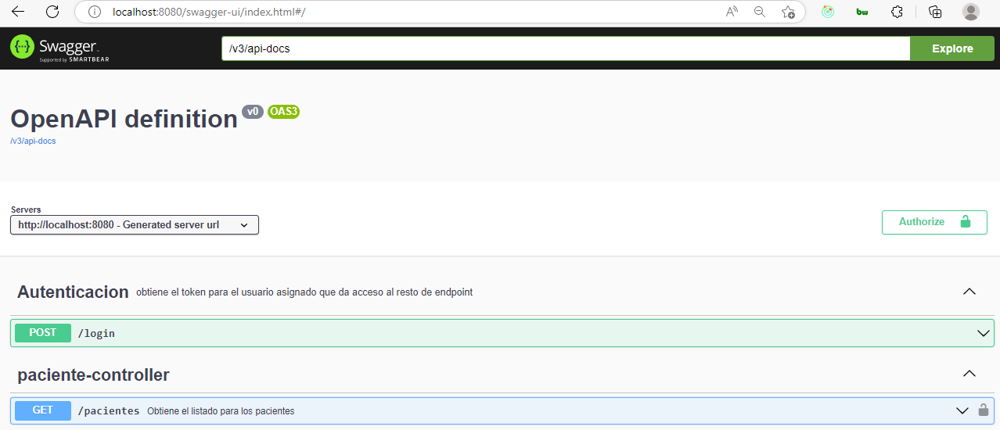

En el video anterior, vimos que es posible personalizar la documentación generada por SpringDoc para incluir el token de autenticación. Además del token, podemos incluir otras informaciones en la documentación que forman parte de la especificación OpenAPI, como la descripción de la API, información de contacto y su licencia de uso.

Estas configuraciones se deben hacer en el objeto OpenAPI, que se configuró en la clase SpringDocConfigurations de nuestro proyecto:

@Bean
public OpenAPI customOpenAPI() {
return new OpenAPI()
.components(new Components()
.addSecuritySchemes("bearer-key",
new SecurityScheme()
.type(SecurityScheme.Type.HTTP)
.scheme("bearer")
.bearerFormat("JWT")))
.info(new Info()
.title("API Voll.med")
.description("API Rest de la aplicación Voll.med, que contiene las funcionalidades de CRUD de médicos y pacientes, así como programación y cancelación de consultas.")
.contact(new Contact()
.name("Equipo Backend")
.email("backend@voll.med"))
.license(new License()
.name("Apache 2.0")
.url("http://voll.med/api/licencia")));  }COPIA EL CÓDIGO
En el código anterior, después de la configuración del token JWT, se agregaron las informaciones de la API. Al acceder nuevamente a la página de Swagger UI, se mostrarán estas informaciones, como se muestra en la imagen a continuación:

Para obtener más detalles sobre qué informaciones se pueden configurar en la documentación de la API, consulte la especificación OpenAPI en el sitio web oficial de la iniciativa.
