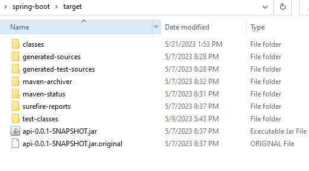

Una de las características más destacadas de la versión 3 de Spring Boot es el soporte para imágenes nativas, algo que reduce significativamente el consumo de memoria y el tiempo de inicio de una aplicación. Algunos otros frameworks competidores de Spring Boot, como Micronaut y Quarkus, ya ofrecían soporte para esta función.

De hecho, era posible generar imágenes nativas en aplicaciones con Spring Boot antes de la versión 3, pero esto requería el uso de un proyecto llamado Spring Native que agregaba soporte para ello. Con la llegada de la versión 3 de Spring Boot, ya no es necesario utilizar este proyecto.

Native Image
Una imagen nativa es una tecnología utilizada para compilar una aplicación Java, incluyendo todas sus dependencias, generando un archivo binario ejecutable que puede ser ejecutado directamente en el sistema operativo sin necesidad de utilizar la JVM. Aunque no se ejecute en una JVM, la aplicación también contará con sus recursos, como la gestión de memoria, el recolector de basura y el control de la ejecución de hilos.

Para obtener más detalles sobre la tecnología de imágenes nativas, consulte la documentación en el sitio web: https://www.graalvm.org/native-image

Native Imagem com Spring Boot 3
Una forma muy sencilla de generar una imagen nativa de la aplicación es mediante un plugin de Maven, que debe incluirse en el archivo pom.xml:

<plugin>
  <groupId>org.graalvm.buildtools</groupId>
  <artifactId>native-maven-plugin</artifactId>
</plugin>COPIA EL CÓDIGO
¡Listo! Esta es la única modificación necesaria en el proyecto. Después de esto, la generación de la imagen debe hacerse a través de la terminal, con el siguiente comando de Maven que se ejecuta en el directorio raíz del proyecto:

./mvnw -Pnative native:compileCOPIA EL CÓDIGO
Este comando puede tardar varios minutos en completarse, lo cual es completamente normal.

¡Atención! Para ejecutar el comando anterior y generar la imagen nativa del proyecto, es necesario que tenga instalado en su computadora GraalVM (una máquina virtual Java con soporte para la función Native Image) en una versión igual o superior a 22.3.

Después de que el comando anterior termine, se generará en la terminal un registro como el siguiente:

Top 10 packages in code area:           Top 10 object types in image heap:
   3,32MB jdk.proxy4                      19,44MB byte[] for embedded resources
   1,70MB sun.security.ssl                16,01MB byte[] for code metadata
   1,18MB java.util                        8,91MB java.lang.Class
 936,28KB java.lang.invoke                 6,74MB java.lang.String
 794,65KB com.mysql.cj.jdbc                6,51MB byte[] for java.lang.String
 724,02KB com.sun.crypto.provider          4,89MB byte[] for general heap data
 650,46KB org.hibernate.dialect            3,07MB c.o.s.c.h.DynamicHubCompanion
 566,00KB org.hibernate.dialect.function   2,40MB byte[] for reflection metadata
 563,59KB com.oracle.svm.core.code         1,30MB java.lang.String[]
 544,48KB org.apache.catalina.core         1,25MB c.o.s.c.h.DynamicHu~onMetadata
  61,46MB for 1482 more packages           9,74MB for 6281 more object types
--------------------------------------------------------------------------------
    9,7s (5,7% of total time) in 77 GCs | Peak RSS: 8,03GB | CPU load: 7,27
--------------------------------------------------------------------------------
Produced artifacts:
 /home/rodrigo/Desktop/api/target/api (executable)
 /home/rodrigo/Desktop/api/target/api.build_artifacts.txt (txt)
================================================================================
Finished generating 'api' in 2m 50s.
[INFO] ------------------------------------------------------------------------
[INFO] BUILD SUCCESS
[INFO] ------------------------------------------------------------------------
[INFO] Total time:  03:03 min
[INFO] Finished at: 2023-01-17T12:13:04-03:00
[INFO] ------------------------------------------------------------------------COPIA EL CÓDIGO
La imagen nativa se genera en el directorio target, junto con el archivo .jar de la aplicación, como un archivo ejecutable de nombre api, como se muestra en la siguiente imagen:

La diferencia del archivo .jar, que se ejecuta en la JVM mediante el comando java -jar, la imagen nativa es un archivo binario y debe ejecutarse directamente desde la terminal:

target/apiCOPIA EL CÓDIGO
Al ejecutar el comando anterior se generará el registro de inicio de la aplicación, que al final muestra el tiempo que tardó la aplicación en iniciarse:

INFO 127815 --- [restartedMain] med.voll.api.ApiApplication : Started ApiApplication in 0.3 seconds (process running for 0.304)COPIA EL CÓDIGO
Observe que la aplicación tardó menos de medio segundo en iniciarse, algo realmente impresionante, ya que cuando se ejecuta en la JVM, a través del archivo .jar, este tiempo aumenta a alrededor de 5 segundos.

Para obtener más detalles sobre la generación de una imagen nativa con Spring Boot 3, consulte la documentación en el sitio: Soporte de imagen nativa GraalVM.